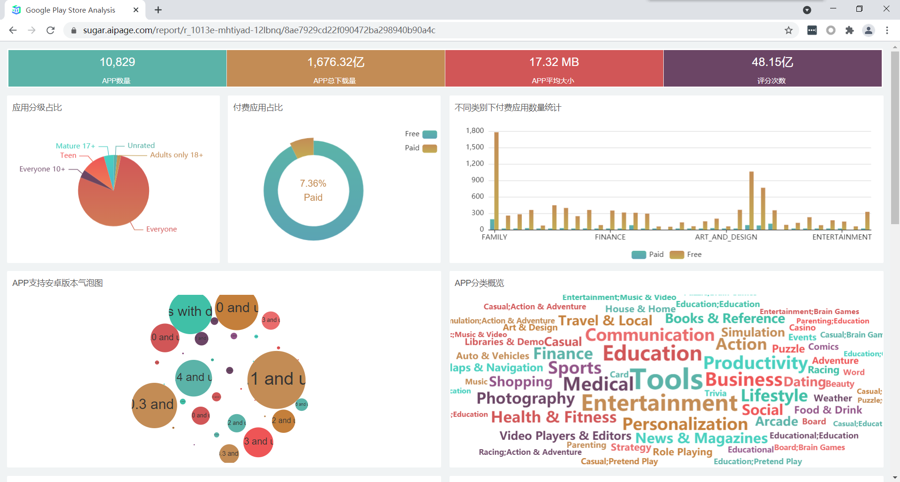
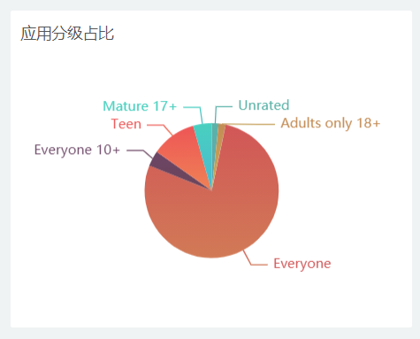
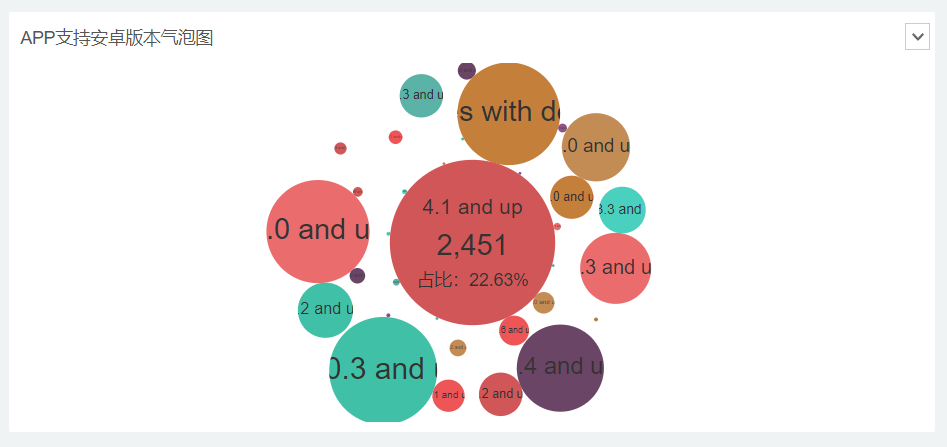
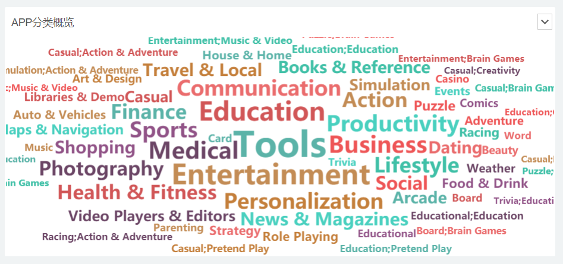
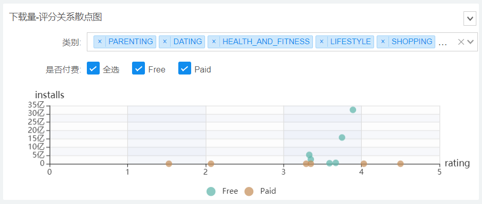
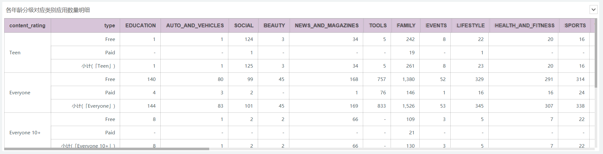
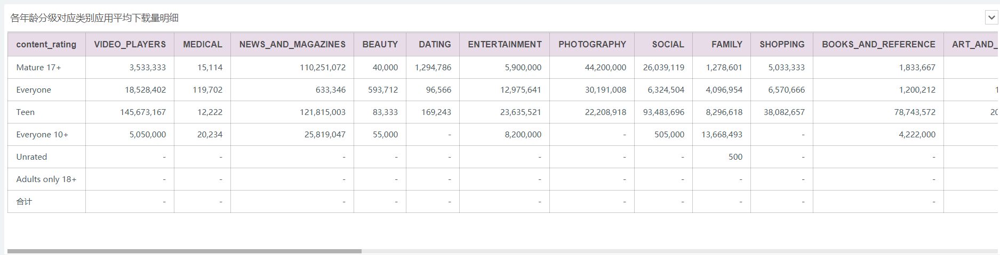

# Lab 3: Data Visualization

[toc]

# Project Background

- **What is Data Visualization?**

    Data visualization is primarily designed to communicate and communicate information clearly and effectively through graphical means. 

    In order to effectively convey the concept of ideas, aesthetic forms and functions need to go hand in hand to achieve insight into fairly sparse and complex data sets by visually communicating key aspects and features.

- **The basic idea of Data Visualization technology?**

    To represent each data item in the database as a single primitive element. A large number of data sets constitute a data image, and each attribute value of the data is represented in the form of multidimensional data, which can be observed from different dimensions. Data to allow for more in-depth observation and analysis of the data.

- **Tasks in Data Visualization**

    | ***Task Categories***         | ***Task Types***                                                                                                                                                                                                                        |
    |-------------------------------|-----------------------------------------------------------------------------------------------------------------------------------------------------------------------------------------------------------------------------------------|
    | *Data and view specification* | **Visualize** data by choosing visual encodings **Filter** out data to focus on relevant items **Sort** items to expose patterns **Derive** values of models from source data                                            |
    | *View manipulation*           | **Select** items to highlight, filter, or manipulate **Navigate** to examine high-level patterns and low level detail **Coordinate** views for linked exploration **Organize** multiple windows and workspaces           |
    | *Process and provenance*      | **Record** analysis histories for revisitation, review, and sharing **Annotate** patterns to document findings **Share** views and annotations to enable collaboration **Guide** users through analysis tasks or stories |

# Screenshots

## Overview

## Pie Chart

## Ring Chart

## Bar Chart

## Bubble Chart

## Word Cloud

## Scatter Chart (Interactive)

## Table

# Online Demo

The dashboard has been deployed publicly, and you can access it by scanning the QR code below.

<a href="https://sugar.aipage.com/report/r_1013e-mhtiyad-12lbnq/8ae7929cd22f090472ba298940b90a4c">https://sugar.aipage.com</a>

