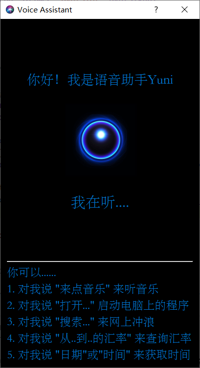

# Lab1: Automatic Speech Recognition

[toc]

# Modifications

## Summary

- [x] Redesign all the *UI* of the app (Use QtDesigner), keep the base framework, but add many new features.

- [x] Now there are two types of *triggers* (Click button or Say something directly)

- [x] Change SR engine from *PocketSphinx* to *BaiduAip*

## UI Appearance

- **Window name**: *Voice Assistant*
- **State indicator (& Button)**: A clickable gif
- **Text response**: Show current state of the assistant. For example, *Listening...* or *Pardon?* or *(what user said)*



## Interaction Logic

There are two ways to activate the assistant:

1. Click the button


2. Say something directly

   For example, I say "今天吃什么".


## Speech Recognition

- Use tools in `SpeechRecognition` package to **listen** to user's command. It will stop automatically when no further detection.
- Use `BaiduAip` to **recognize** the audio.
- Use `difflib` to **understand** what user has said.
- Use `QTimer` and `QThread` to do ASR tasks repeatedly in the background. Loops every 1 second.

## Assistant Functions

- Play some music: Say **播放音乐**, or **来点音乐**
- Open the notepad: Say **编辑文本**, **编辑文件**, or **打开记事本**
- Open the browser: Say **打开浏览器**
- Open the Wechat: Say **打开微信**
- Search for something (Using the *bing* search engine): Say **搜索xxx**

```python
# app_function.py
import win32api

def play_music():
    win32api.ShellExecute(0, 'open', '8071.mp3', '', 'assets', 1)

def open_file():
    win32api.ShellExecute(0, 'open', 'notepad.exe', '', '', 1)

def search(keyword):
    win32api.ShellExecute(0, 'open', f'www.bing.com/search?q={keyword}', '', '', 1)

def open_browser():
    win32api.ShellExecute(0, 'open', 'firefox.exe', '', '', 1)

def open_wechat():
    win32api.ShellExecute(0, 'open', "C:\Program Files (x86)\Tencent\WeChat\WeChat.exe", '', '', 1)
```

# Analysis

## Accuracy of speech recognition

### SR library Comparison

- `Pocket Sphinx`
  
  - Support only one language per recognition.
  - Tested, but very poor.
  - Very sensitive to English pronunciation.
  - Off-line.
  - Free.
  
- `BaiduAip`
  
  - Support Chinese and some common English.
  - Used in Baidu IME, very accurate.
  - On-line.
  - Free limited / Paid.
  
  

### Audio Record

- `PyAudio`: 

  - Support multi sampling rates, number of channels, audio format.
  - Set how long we need to record manually 

- `SpeechRecognition`: 
  - Only support 1 channel. 
  - Contains algorithms for adjusting for ambient noise: `sr.Recognizer().adjust_for_ambient_noise`
  - Stop automatically when there is no sound.

### Improvement

- Audio Record

  - Use duration of *0.5 second* for `adjust_for_ambient_noise` function call
  - Record Parameters: Rate of 16000, 1 Channel, Format of `pyaudio.paInt16`

- Speech Recognition

  - Use *Baidu short speech recognition service*, which is much better.