# Lab2: Information Retrieval —— Image Search System

[toc]

# Requirement Analysis of Image Search Task

To meet the requirements of an image search task, we need the following parts at least:

1. An index page which hold a brief introduction, for user to know what the image search engine can do.

2. A place user can upload images.

3. A loading picture, which can indicate that the engine is working

4. The input file, to let the user know what he/she upload to search just now.

5. The overview of the results, for example, the number of similar images.

6. Details of every similar image, including image id and tags.

7. A filter which user can filter the result images by tags, the tags should be unique.

8. A favorite list, where the user can add the images of the result to. 

9. A reset button to clear the result and search image again.

# Design for five stages

## Formulation

- [x] It contains an input box to upload an image;
- [x] Also support uploading by *drag and drop*;

## Initiation

- [x] It has a carousel to attract users to use;
- [x] It has a search button;
- [x] It has a reset button;
- [x] It has a download button to get a duplication of the image;

## Review

- [x] Provide an overview of the results (e.g. the total number of results);
- [x] It has a like button to add/remove the image to/from my favorite list;
- [x] Browse the favorite images in *my favorite* page;

## Refinement

- [x] Filtering by image tags when reviewing results;

## Use

- [x] Users can add selected images to a favorite list;
- [x] Users can remove the images from the favorite list;
- [x] Users can download the images in the favorite list;
- [x] Users can zoom in/out, flip vertically/horizontally, rotate left/right or even play a slide of the images;

# Screenshots

## Index Page

An index page with a *navigation header* and an *image carousel*. 

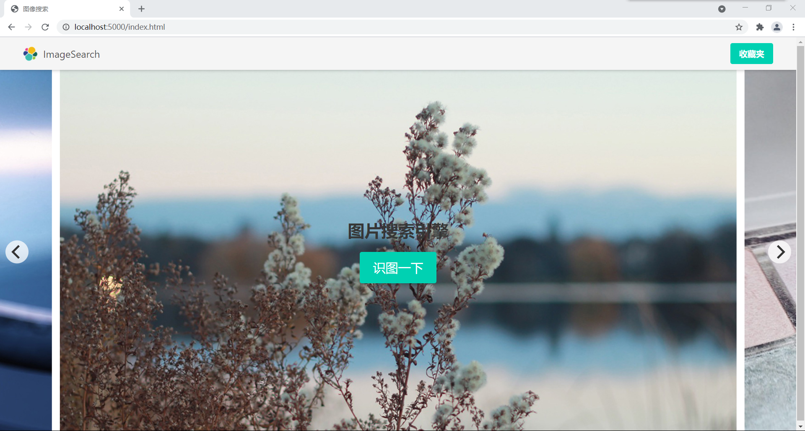

Click the <kbd>识图一下</kbd> button, we can look an image upload button.

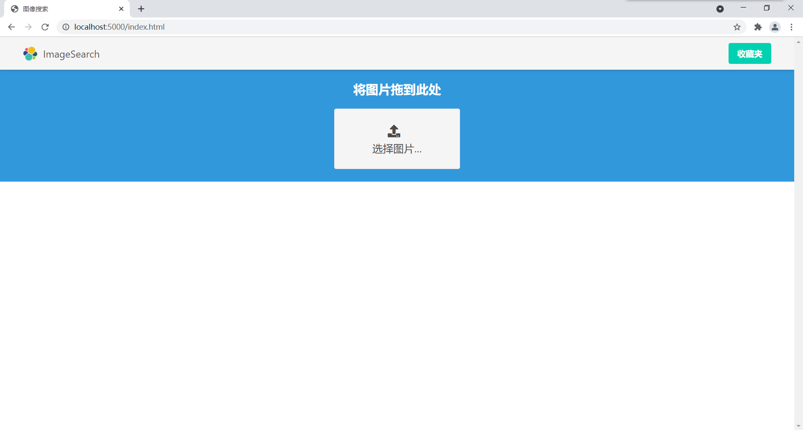

You can upload an image by two ways:
- Click on the button and select a file in the pop-up dialog
- Drag an image file and drop it on the blue region.

After selecting an image, the searching process will start automatically at the background, and a *searching gif* will appear.

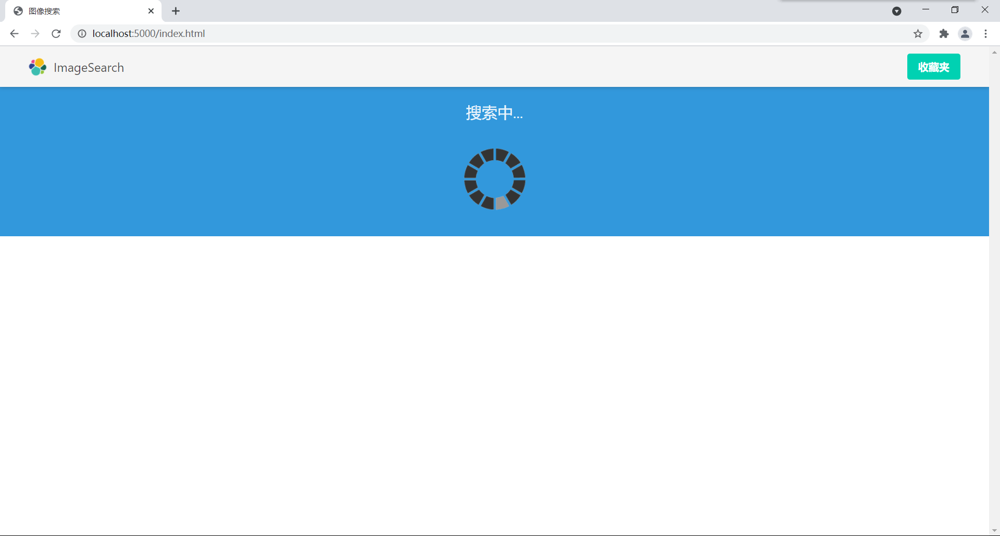

When the search process finished, the result will appear.

On the top of the page is the number of searching results. 

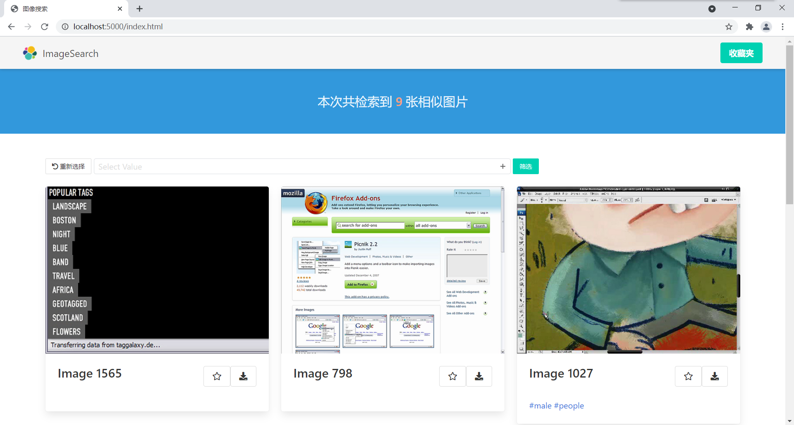

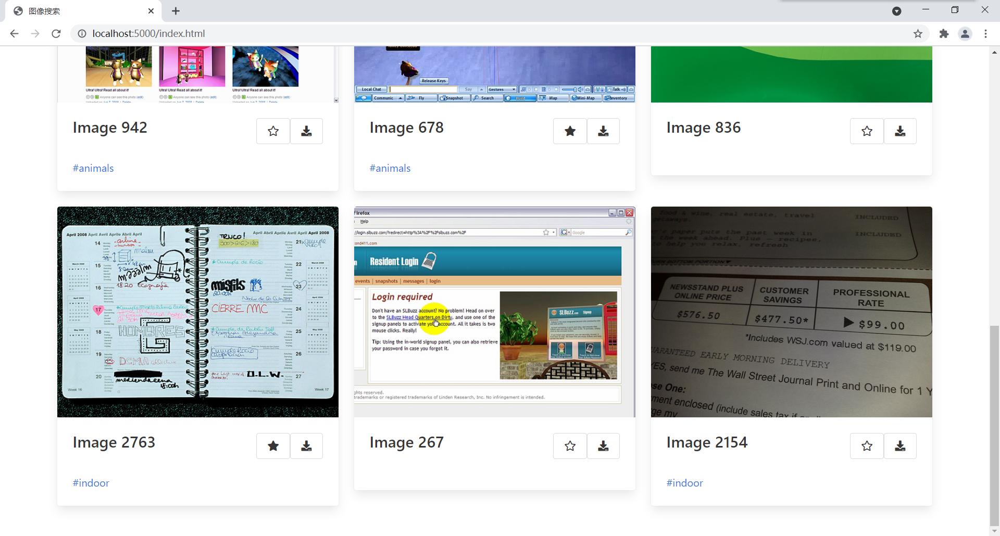

For each result image, there will be a card containing the image, image id, a favorite button (the star), a download button, and a list of tags. 

The favorite button will be solid if you have added the image to your favorite list.

| Before favorite               | After favorite                |
| ----------------------------- | ----------------------------- |
| 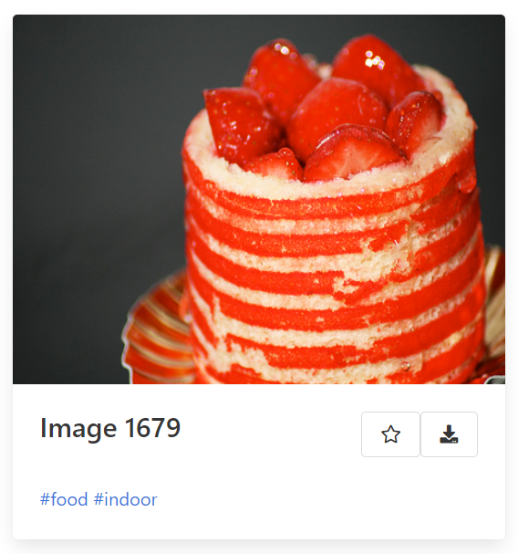 | 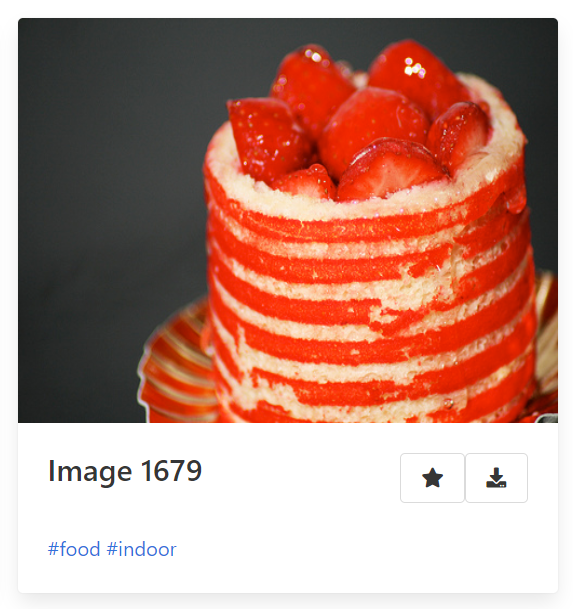 |

Before the results, there is a control bar. You can <kbd>重新选择</kbd>, or **filter the results by tags**.

> For example, I filter the result whose tags contain "people" (The result is zoomed in because there is only one result)
> 
> 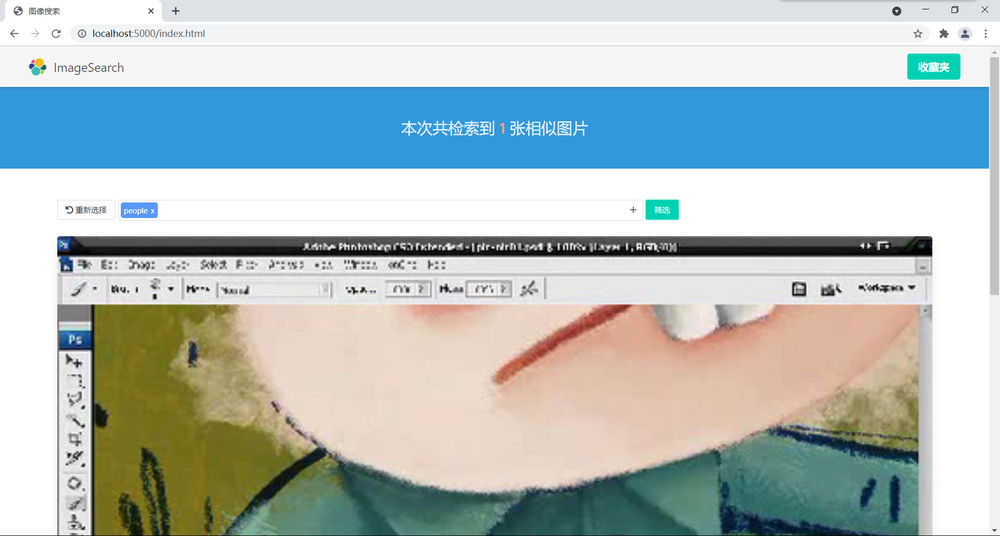

You can add an image to your favorite list by clicking the <kbd>Star</kbd> icon. And cancel it by clicking again. The star will shake.

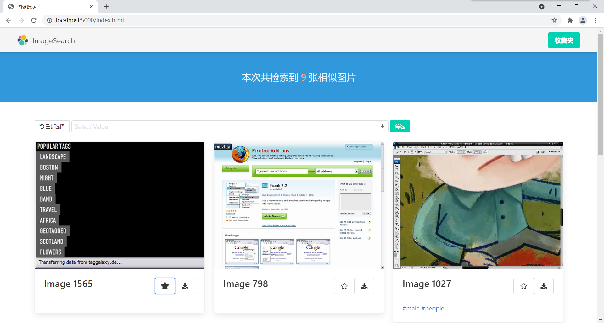

## My Favorite Page

You can browse your favorite list in this page. You can also remove some images from favorite list, or download the images

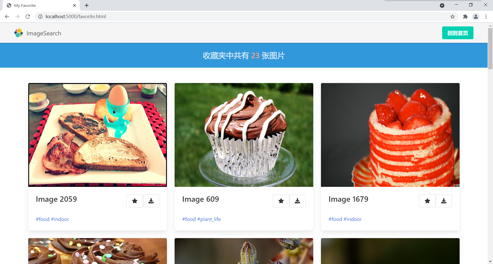

# Project Structure

```
.
├── README.md
├── Report of Lab2.md
├── database
│   ├── dataset [2955 entries]
│   └── tags [39 entries]
├── image_vectorizer.py
├── imagenet
│   ├── LICENSE
│   └── classify_image_graph_def.pb
├── neighbor_list_recom.pickle
├── requirements.txt
├── rest-server.py
├── saved_features_recom.txt
├── search.py
└── static
    ├── favorite.html
    ├── index.html
    ├── images
    │   ├── ajax-loader.gif
    │   └── elasticsearch-logo-640x196.png
    └── js
        ├── animated.js
        └── favorites.js
```

# Implementation

## General

Generally, I use these libraries/technologies to implement this lab.

| Framework/Library | Where     | Remark                    |
| ----------------- | --------- | ------------------------- |
| *Knockout.js*     | Front End | MVVM Framework            |
| *Bulma*           | Front End | UI Style                  |
| *font-awesome*    | Front End | UI Icons                  |
| *flickity*        | Front End | Carousel in index page    |
| *viewerjs*        | Front End | Image viewer              |
| *slimselect*      | Front End | Drop-down menu tag filter |
| *animate.css*     | Front End | "Favorite" Animation      |
| *Flask*           | Back End  | Micro Web Framework       |
| *tensorflow*      | Back End  | DL Framework              |
| *numpy*           | Back End  | Recommendation Model      |
| *scipy*           | Back End  | Recommendation Model      |

## The carousel in the index page

I use *flickity* to make a carousel. It will auto play and is wrap around.

```html
<section style="position: relative;">
    <div class="main-carousel" data-flickity='{ "wrapAround": true, "autoPlay": true, "pageDots": false }'>
        <figure class="slide">
            
        </figure>
        <figure class="slide">
            
        </figure>
        <figure class="slide">
            
        </figure>
        <figure class="slide">
            
        </figure>
        <figure class="slide">
            
        </figure>
    </div>

    <div class="has-text-centered" style="position: absolute; top: 50%; left: 50%; transform: translate(-50%, -50%);">
        <p class="title">图片搜索引擎</p>
        <button class="button is-primary is-large"
                data-bind="click: function() { state(State.SELECTIMAGE); }">识图一下</button>
    </div>
</section>

<style>
    .slide {
        width: 85%;
        height: calc(100vh - 58.4px);
        margin-right: 15px;
    }

    .slide img {
        object-fit: cover;
        width: auto;
        min-height: 100%;
        display: block;
    }
</style>
```

## Display of the results

For each result image, there will be a card containing the image, image id, a favorite button (the star), a download button, and a list of tags. 

The favorite button will be solid if you have added the image to your favorite list.

| Before favorite               | After favorite                |
| ----------------------------- | ----------------------------- |
|  |  |

## Zoom effect

Click the image of a card, a viewer modal will show. In the modal, you can zoom in/out, flip vertically/horizontally, rotate left/right or even play a slide of the images.

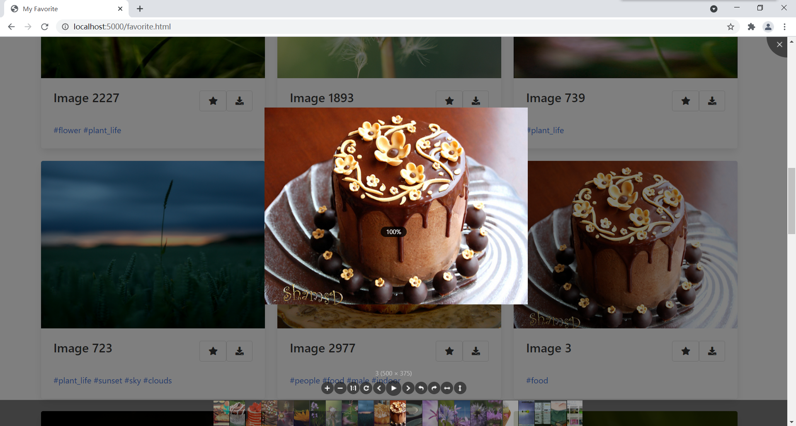

## Tags & Filter

### Get Tags

When the rest-server starts, it will load all image tags in memory and save them to a *dict*

```python
id_tag_dict = {}

for f in Path('database/tags').glob('*'):
    tag_name = os.path.splitext(f.name)[0]
    if tag_name.endswith('_r1'):
        tag_name = tag_name[:-3]
    with open(f, 'r') as fp:
        for line in fp:
            try:
                image_id = line.strip()
                id_tag_dict.setdefault(image_id, set())
                id_tag_dict[image_id].add(tag_name)
            except Exception as ex:
                print(f.name, fp.tell(), line)
                print(ex)
print("loaded id_tag_dict")
```

And implement an API to retrieve image tags by id list.

```python
@app.route("/get_tag", methods=["POST"])
def get_tag():
    image_id_list = request.get_json(force=True)
    return {
        'images': [{
            'id': image_id,
            'tag': list(id_tag_dict[image_id])
        } for image_id in image_id_list
            if image_id in id_tag_dict]
    }
```

### Show tags

I use *data-bind* and *foreach* of knockout.js to dynamically map image tags to an *<a>* label.

```html
<div class="content">
  <span data-bind="foreach: tag">
    <a href="#" data-bind="text: '#' + $data"></a>
  </span>
</div>
```

## Favorites

### Information Storage

My favorite list is storage in the browser's `localStorage`.

Even you refresh the browser, the list won't be clear.

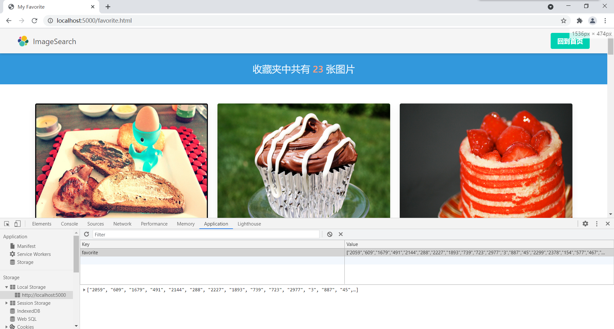

### Browse my favorites

I design a new page to display my favorites.


### Add images to my favorites

Click on the *star* at the right of an image, an animation will be played, and the star will be black.

## Misc

### Image retrieve

I create an API to get the image data by image id. And set the cache time to **43200** seconds to reduce server pressure.

```python
@app.route('/image/<int:image_id>', methods=['GET'])
def get_image(image_id):
    headers = {
        "Content-Disposition": f"attachment; filename=im{image_id}.jpg",
        "Content-Type": "image/jpeg",
        "Cache-Control": "public, max-age=43200"
    }
    with open(f'database/dataset/im{image_id}.jpg', 'rb') as f:
        body = f.read()
    return make_response((body, headers))
```

### Recommend API change

I change the recommend API to avoid reading/writing to the file system.

What's more, because I have 1 GPU card, I set it in TensorFlow's configuration. 

```python
@app.route('/imgUpload', methods=['GET', 'POST'])
def upload_img():
    # check if the post request has the file part
    if 'file' not in request.files:
        return 'No file', 400

    file = request.files['file']
    count = request.values.get('count', 9)

    image_id_list = search.recommend(file.read(), extracted_features, count)
    print(image_id_list)

    return {
        'images': [{
            'id': image_id,
            'tag': list(id_tag_dict.get(image_id, []))
        } for image_id in image_id_list]
    }

def recommend(image_data, extracted_features, k=9):
    tf.reset_default_graph()
    config = tf.ConfigProto(
        device_count={'GPU': 1}
    )
    sess = tf.Session(config=config)
    _, bottleneck_tensor, jpeg_data_tensor, _ = create_inception_graph()
    features = run_bottleneck_on_image(sess, image_data, jpeg_data_tensor, bottleneck_tensor)
    return get_top_k_similar(features, extracted_features, neighbor_list, k)

def get_top_k_similar(image_data, pred, pred_final, k):
    top_k_ind = np.argsort([cosine(image_data, pred_row) for pred_row in pred])[:k]
    return [Path(pred_final[neighbor]).name[2:-4] for neighbor in top_k_ind]
```

