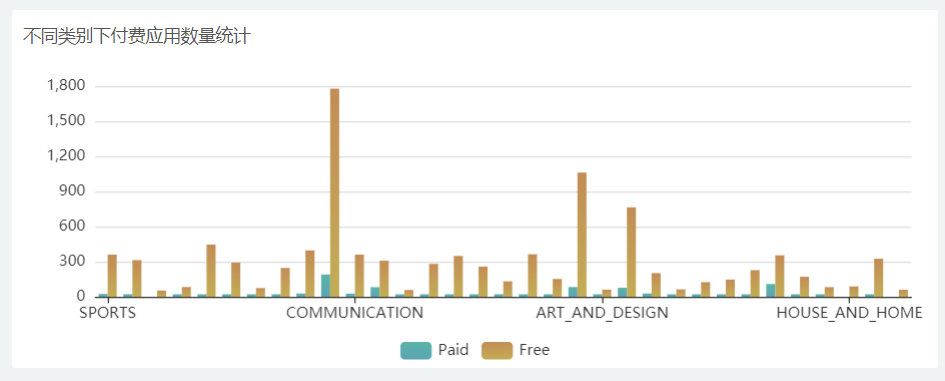

# Lab 3: Data Visualization

[toc]

# Project Background

Data visualization is primarily designed to communicate information clearly and effectively through graphical means. 

In order to effectively convey the concept of ideas, aesthetic forms and functions need to go hand in hand to achieve insight into fairly sparse and complex data sets by visually communicating key aspects and features.

- The basic idea of Data Visualization technology

To represent each data item in the database as a single primitive element. A large number of data sets constitute a data image, and each attribute value of the data is represented in the form of multidimensional data, which can be observed from different dimensions. Data to allow for more in-depth observation and analysis of the data.

- Tasks in Data Visualization

| ***Task Categories***         | ***Task Types***                                                                                                                                                                                                                        |
|-------------------------------|-----------------------------------------------------------------------------------------------------------------------------------------------------------------------------------------------------------------------------------------|
| *Data and view specification* | **Visualize** data by choosing visual encodings<br />**Filter** out data to focus on relevant items<br />**Sort** items to expose patterns<br />**Derive** values of models from source data                                            |
| *View manipulation*           | **Select** items to highlight, filter, or manipulate<br />**Navigate** to examine high-level patterns and low level detail<br />**Coordinate** views for linked exploration<br />**Organize** multiple windows and workspaces           |
| *Process and provenance*      | **Record** analysis histories for revisitation, review, and sharing<br />**Annotate** patterns to document findings<br />**Share** views and annotations to enable collaboration<br />**Guide** users through analysis tasks or stories |

# Data Analysis and Preprocess

In this time, we have 3 dataset to use. I choose the Google App Store dataset for visualization.

## Analysis

Google App Store has hundreds of thousands of software on the shelves, and the number of downloads has exceeded 2 billion times. For the majority of Android mobile phone users, it provides a very wide range of application options, which is very popular with users. More than 20000 pieces of music, free and paid,more than 450000 Android applications and games,the largest e-book market in the world.You can rent thousands of movies, including the latest movies and HD movies.Therefore, the app data in Google play story is more typical and comprehensive. 

As a result, the analysis of APP related data is helpful for domestic companies in the production and operation of app. The structure of the data in the table is as follows.

## Preprocess

I use python pandas library to preprocess the data. The code is as follows. 

```python
import pandas as pd


def parse_number(s: str):
    s = s.replace(',', '')

    unit = s[-1]
    try:
        if unit == 'M':
            return int(float(s[:-1]) * 1000000)
        elif unit == 'k':
            return int(float(s[:-1]) * 1000)
        return int(s)
    except:
        return 0

df = pd.read_csv("googleplaystore.csv")

df['Size'] = df['Size'].apply(parse_number)

df['Installs'] = df['Installs'].apply(lambda s: int(s.replace(",", '').rstrip("+")))

df['Price'] = df['Price'].apply(lambda s: float(s.lstrip('$')))

df['Rating'] = df['Rating'].fillna(0)

df.dropna(inplace=True)
df.info()

df.to_csv("googleplaystore_pre.csv", index=None)
```

The code is very explicit. After preprocess, the structure of the data is as follows. 

| #  | Column         | Count | type   |
|----|----------------|-------|--------|
| 0  | App            | 10829 | string |
| 1  | Category       | 10829 | string |
| 2  | Rating         | 10829 | float  |
| 3  | Reviews        | 10829 | int64  |
| 4  | Size           | 10829 | int64  |
| 5  | Installs       | 10829 | int64  |
| 6  | Type           | 10829 | string |
| 7  | Price          | 10829 | float  |
| 8  | Content_Rating | 10829 | string |
| 9  | Genres         | 10829 | string |
| 10 | Last_Updated   | 10829 | string |
| 11 | Current_Ver    | 10829 | string |
| 12 | Android_Ver    | 10829 | string |

# Dashboard Implementation

After preprocessing of the data, I started to design my dashboard. I use the *Baidu Data Visualization-Sugar* to build my big data screen. I made several charts to display the data.

In the *Sugar* tools, we need to upload our data to create a *data source* first.


Then use the *data source* to create a *data model*


Then we can edit the dashboard in the page.


# Screenshots

## Overview


## Pie Chart


## Ring Chart


## Bar Chart



## Bubble Chart


## Word Cloud


## Scatter Chart (Interactive)


## Table


# Online Demo

The dashboard has been deployed publicly, and you can access it by scanning the QR code below.

<div style="text-align: center">

<a href="https://sugar.aipage.com/report/r_1013e-mhtiyad-12lbnq/8ae7929cd22f090472ba298940b90a4c">https://sugar.aipage.com</a>
</div>