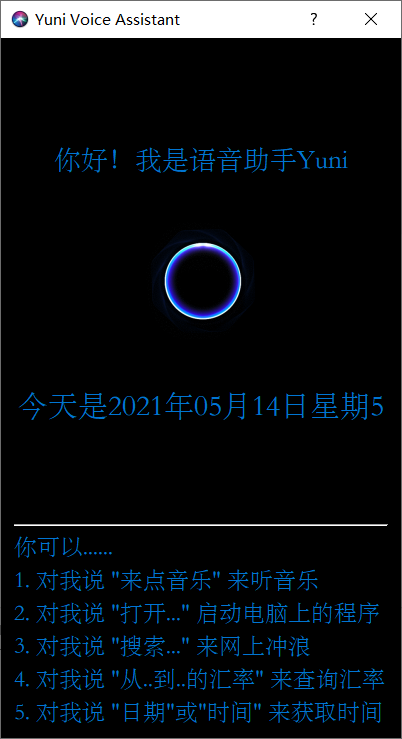
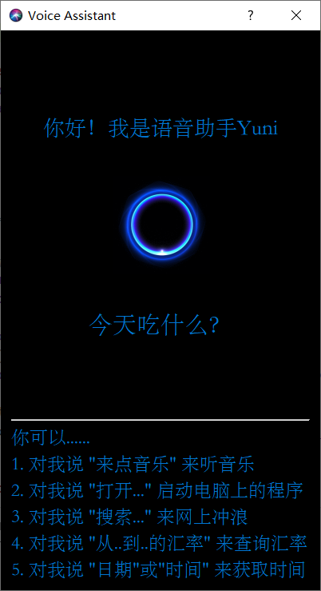

# Lab1: Automatic Speech Recognition —— Yuni Voice Assistant

[toc]

# Background

Nowadays, there are many voice assistants on the market, and many large companies such as Xunfei, Google, Sogou, etc. have successively launched their own voice assistant services and corresponding API interfaces. It makes it easy for us to use the interface it provides to build our own voice assistant and implement some simple functions.

# Introduction

1. Say "你好，Yuni" or "Hello, Yuni" to wake up the voice assistant.
2. The help instructions is in the bottom of the initial page.
3. After waking up Yuni:
    1. "来点音乐" or "播放音乐" to play music.
    2. "打开..." or "启动..." to start application.
        - Support applications: *Browser*, *Text Editor*, *Calculator*, *Calender*, *Wechat* and *Music player*, etc. 
    3. "用...搜索..." to search something.
        - Support search engines: *Baidu*, *Google*, *Bing*
        - Your can search for anything here!
    4. "从...到...的汇率" to check current exchange rate.
        - Support *152 currencies*.
    5. "今天是几月/几号/星期几" to check the date now.
    5. "现在几点" to check the time now.
4. Exit the voice assistant


# Run the Program

* You can run the program by running `app.py` in PyCharm or other IDEs
* Or running by command in the root directory: `python app.py`

# Screenshots

## Main window


## Exchange rate query

For example, I said "从人民币到美元的汇率是多少？" to Yuni Assistant.


## Check the time

For example, I said "现在几点了？" to Yuni Assistant.


## Check the date

For example, I said "今天周几？" to Yuni Assistant.



## Unknown Result


## Speech Recognition Result

For example, I said "今天吃什么" to Yuni Assistant.



# Implementation

## Speech Recognition

Detect the user's voice command through the microphone, automatically stop when the sound cannot be detected, and perform voice recognition through `aip.AipSpeech`

```python
import speech_recognition as sr
from aip import AipSpeech

client = AipSpeech(APP_ID, API_KEY, SECRET_KEY)

def baidu_asr(wave, format, rate):
    return client.asr(wave, format, rate, {
        'dev_pid': 1537,
    })

r = sr.Recognizer()

with sr.Microphone(sample_rate=16000) as source:
    r.adjust_for_ambient_noise(source)
    audio = r.listen(source)
    pcm = audio.frame_data
    
text = baidu_asr(pcm, 'pcm', 16000)
```

## Instruction Matching

Match instruction similarity through keyword detection and `string_similar`.

```python
import difflib

def string_similar(s1, s2):
    return difflib.SequenceMatcher(None, s1, s2).quick_ratio()
```

```python
try:
    if '播放音乐' in text or '来点音乐' in text:
        app_function.play_music(self)
    elif '编辑文本' in text or '编辑文件' in text or '打开记事本' in text:
        app_function.open_program(self, '记事本')
    elif '打开' in text:
        keyword = text[text.index('打开') + 2:]
        app_function.open_program(self, keyword)
    elif '启动' in text:
        keyword = text[text.index('启动') + 2:]
        app_function.open_program(self, keyword)
    elif '搜索' in text:
        keyword = text[text.index('搜索') + 2:]
        if '百度' in text:
            app_function.search(self, keyword, 'baidu')
        elif '谷歌' in text:
            app_function.search(self, keyword, 'google')
        else:
            app_function.search(self, keyword, 'bing')
    elif '汇率' in text:
        keyword1 = text[text.index('从') + 1:text.index('到')]
        keyword2 = text[text.index('到') + 1:text.index('的汇率')]
        app_function.exchange_rate(self, keyword1, keyword2)
    elif '几点了' in text or '时间' in text:
        app_function.report_time(self)
    elif '哪年' in text or '几月' in text or '几号' in text or '星期几' in text or '日期' in text:
        app_function.report_date(self)
    elif 'hello' in text or '你好' in text:
        self.ui.status.setText('你好，我是Yuni')
    else:
        self.ui.status.setText('什么？我没有听清....')
except:
    self.ui.status.setText('什么？我没有听清....')
```

## Listening Loop

Use `QTimer.timeout` to automatically trigger the speech recognition subroutine by 1 second.

When the user triggers the subroutine manually by clicking the button, we will stop the running thread immediately and replace it with a new one. 

```python
'''自动触发识别'''
class myWindow(QtWidgets.QDialog):
    def __init__(self):
        # ......
        self.timer = QTimer(self)
        self.timer.setInterval(1000)
        self.timer.timeout.connect(self.start_asr)
        self.timer.start()

    @pyqtSlot()
    def start_asr(self):
        self.timer.stop()
        # ......
        self.asr_thread.start()

    def on_succ(self, text):
        # ......
        self.timer.start()

    def on_err(self, err):
        self.timer.start()
        # ......
```

## Monitoring mouse click events

- Users can click the gif at the center of the homepage to trigger the speech recognition subroutine

```python
class myWindow(QtWidgets.QDialog):
    # ......

    @pyqtSlot()
    def on_voiceFig_clicked(self):
        '''手动触发识别'''
        self.asr_thread.terminate()
        self.asr_thread = AsrThread(self.on_succ, self.on_err)
        self.start_asr()
```

## Instruction Execution

- **Open websites**: `win32api.ShellExecute(0, 'open', 'www.hao123.com', '', '', 1)`
- **Start native programs**: `win32api.ShellExecute(0, 'open', 'calc.exe', '', '', 1)`
- **Get data from Internet**: `requests.get(url)`
- etc.

```python
# app_function.py

def exchange_rate(instance, from_str, to_str):
    try:
        from_code = sorted(map(lambda item: (item[0], string_similar(from_str, item[1])), table), key=lambda x: x[1], reverse=True)[0][0]
        to_code = sorted(map(lambda item: (item[0], string_similar(to_str, item[1])), table), key=lambda x: x[1], reverse=True)[0][0]
        url = f"http://webforex.hermes.hexun.com/forex/quotelist?code=FOREX{from_code}{to_code}&column=Code,Price"
        print(from_str, to_str, url)
        res = requests.get(url)
        rate = json.loads(res.text[1:-2])["Data"][0][0][1]/10000
        instance.ui.status.setText(f'从{from_str}到{to_str}的汇率是: {rate}')
    except Exception as ex:
        instance.ui.status.setText(random.choice(['这超出了我的知识范围了呢', '我还需要学习']))
        print(ex)


def play_music(instance):
    win32api.ShellExecute(0, 'open', '8071.mp3', '', 'assets', 1)
    instance.ui.status.setText('请欣赏《难忘今宵》')


def report_date(instance):
    instance.ui.status.setText(f'今天是{datetime.now().strftime("%Y年%m月%d日星期%w")}')


def report_time(instance):
    instance.ui.status.setText(f'现在是背景时间{datetime.now().strftime("%H时%M分%S秒")}')


def open_program(instance, program_name):
    if '浏览器' in program_name:
        win32api.ShellExecute(0, 'open', 'www.hao123.com', '', '', 1)

    elif '文本编辑器' in program_name:
        win32api.ShellExecute(0, 'open', 'notepad.exe', '', '', 1)

    elif '计算器' in program_name:
        win32api.ShellExecute(0, 'open', 'calc.exe', '', '', 1)

    elif '日历' in program_name:
        win32api.ShellExecute(0, 'open', 'calender.exe', '', '', 1)

    elif '微信' in program_name:
        win32api.ShellExecute(0, 'open', "C:\Program Files (x86)\Tencent\WeChat\WeChat.exe", '', '', 1)

    elif '音乐播放器' in program_name:
        win32api.ShellExecute(0, 'open', '8071.mp3', '', 'assets', 1)

    else:
        instance.ui.status.setText(random.choice(['这超出了我的知识范围了呢', '我还需要学习']))


def search(instance, keyword, engine):
    win32api.ShellExecute(0, 'open', f'www.{engine}.com/{"s?wd" if engine == "baidu" else "search?q"}={keyword}', '', '', 1)
```

# Developing Environments

1. **Operating System**: Windows_NT x64 10.0.19042
2. **Visual Studio Code**: *1.56.0*
3. **Qt Designer**: *5.15.2.1.0.1*

## Dependency

| Package           | Version      |
|-------------------|--------------|
| baidu-aip         | 2.2.18.0     |
| PyAudio           | 0.2.11       |
| PyQt5             | 5.15.2       |
| pywin32           | 300          |
| qt5-tools         | 5.15.2.1.0.1 |
| SpeechRecognition | 3.8.1        |

## To install

`pip install -r requirements.txt`