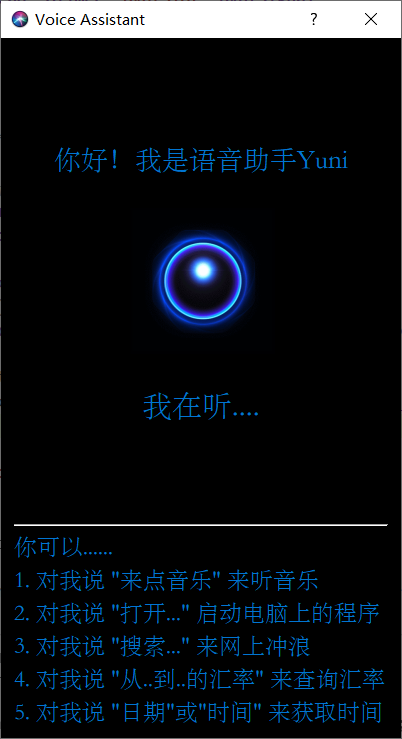
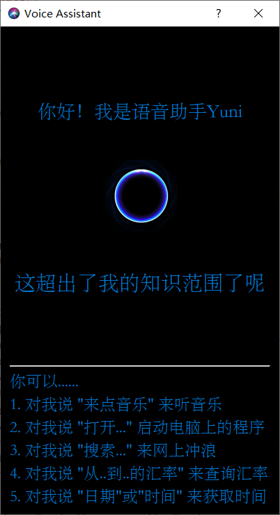
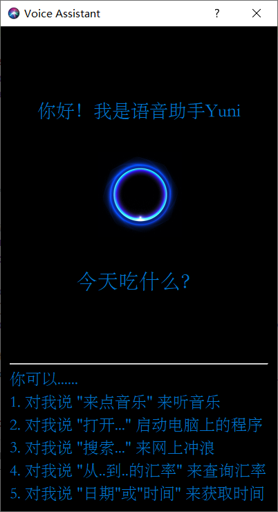
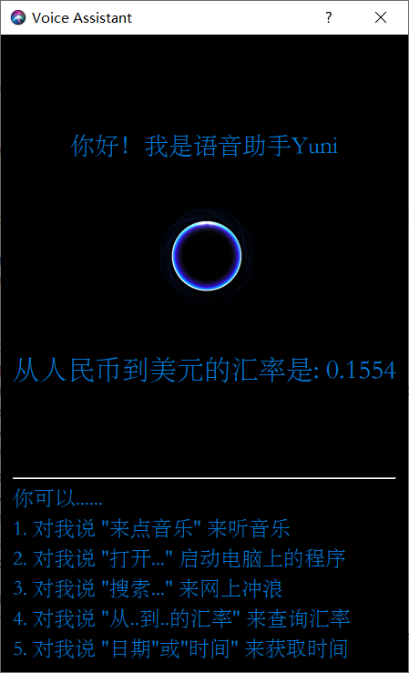
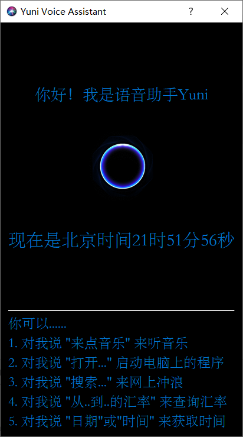
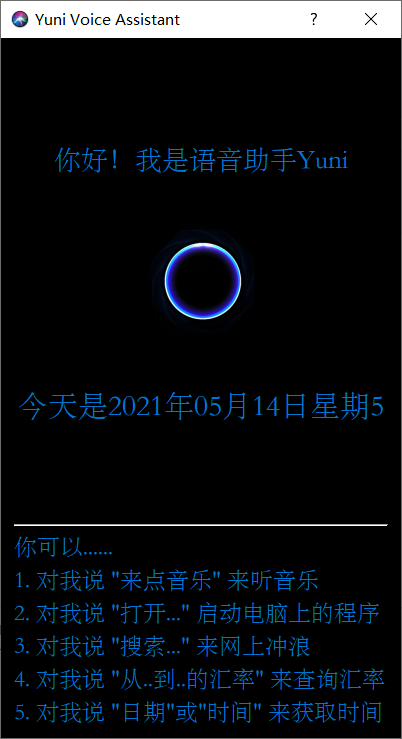

# Lab1: Automatic Speech Recognition —— Yuni Voice Assistant

[toc]

# Modifications

## Summary

- [x] Redesign all the *UI* of the app (Use QtDesigner), keep the base framework, but add many new features.

- [x] Now there are two types of *triggers* (Click button or Say something directly) to wake up the assistant

- [x] Change SR engine from *PocketSphinx* to *BaiduAip*, the accuracy of speech recognition is significantly improved

- [x] Add lots of new functions

## UI Appearance

- **Change window name**: *Yuni Voice Assistant*
- **Change window icon**

  

- **Change window status icon**

  

- **State indicator (& Button)**: A clickable gif
  
  

- **Text response**: Show current state of the assistant. For example, *我在听...* or *这超出了我的知识范围* or *(what user said)*

  
  

## Interaction Logic

There are two ways to activate the assistant:

1. **Click the button**

    

2. **Say something directly**

    For example, I said "今天吃什么".

    

## Instruction Matching

Match instruction similarity through keyword detection and `string_similar`.

```python
import difflib

def string_similar(s1, s2):
    return difflib.SequenceMatcher(None, s1, s2).quick_ratio()
```

```python
try:
    if '播放音乐' in text or '来点音乐' in text:
        app_function.play_music(self)
    elif '编辑文本' in text or '编辑文件' in text or '打开记事本' in text:
        app_function.open_program(self, '记事本')
    elif '打开' in text:
        keyword = text[text.index('打开') + 2:]
        app_function.open_program(self, keyword)
    elif '启动' in text:
        keyword = text[text.index('启动') + 2:]
        app_function.open_program(self, keyword)
    elif '搜索' in text:
        keyword = text[text.index('搜索') + 2:]
        if '百度' in text:
            app_function.search(self, keyword, 'baidu')
        elif '谷歌' in text:
            app_function.search(self, keyword, 'google')
        else:
            app_function.search(self, keyword, 'bing')
    elif '汇率' in text:
        keyword1 = text[text.index('从') + 1:text.index('到')]
        keyword2 = text[text.index('到') + 1:text.index('的汇率')]
        app_function.exchange_rate(self, keyword1, keyword2)
    elif '几点了' in text or '时间' in text:
        app_function.report_time(self)
    elif '哪年' in text or '几月' in text or '几号' in text or '星期几' in text or '日期' in text:
        app_function.report_date(self)
    elif 'hello' in text or '你好' in text:
        self.ui.status.setText('你好，我是Yuni')
    else:
        self.ui.status.setText('什么？我没有听清....')
except:
    self.ui.status.setText('什么？我没有听清....')
```

## Speech Recognition

- Use tools in `SpeechRecognition` package to **listen** to user's command. It will stop automatically when no further detection.
- Use `BaiduAip` to **recognize** the audio.
- Use `difflib` to **understand** what user has said.
- Use `QTimer` and `QThread` to do ASR tasks repeatedly in the background. Loops every 1 second.

## Listening Loop (Automatic)

Use `QTimer.timeout` to automatically trigger the speech recognition subroutine by 1 second.

When the user triggers the subroutine manually by clicking the button, we will stop the running thread immediately and replace it with a new one. 

```python
'''自动触发识别'''
class myWindow(QtWidgets.QDialog):
    def __init__(self):
        # ......
        self.timer = QTimer(self)
        self.timer.setInterval(1000)
        self.timer.timeout.connect(self.start_asr)
        self.timer.start()

    @pyqtSlot()
    def start_asr(self):
        self.timer.stop()
        # ......
        self.asr_thread.start()

    def on_succ(self, text):
        # ......
        self.timer.start()

    def on_err(self, err):
        self.timer.start()
        # ......
```

## Monitoring mouse click events (Manual)

- Users can click the gif at the center of the homepage to trigger the speech recognition subroutine

```python
class myWindow(QtWidgets.QDialog):
    # ......

    @pyqtSlot()
    def on_voiceFig_clicked(self):
        '''手动触发识别'''
        self.asr_thread.terminate()
        self.asr_thread = AsrThread(self.on_succ, self.on_err)
        self.start_asr()
```

## Assistant Functions

- Play some music: Say **播放音乐**, or **来点音乐**
- Open applications: Say **打开...** or **启动...**
  - Support applications: *Browser*, *Text Editor*, *Calculator*, *Calender*, *Wechat* and *Music player*, etc. 
- Search for something: Say **用...搜索...**
  - Support search engines: *Baidu*, *Google*, *Bing*
  - Your can search for anything here!
- Check current exchange rate: Say **从...到...的汇率**
- Check the date now: Say **今天是几月/几号/星期几**
- Check the time now: Say **现在几点**

```python
# app_function.py

def exchange_rate(instance, from_str, to_str):
    try:
        from_code = sorted(map(lambda item: (item[0], string_similar(from_str, item[1])), table), key=lambda x: x[1], reverse=True)[0][0]
        to_code = sorted(map(lambda item: (item[0], string_similar(to_str, item[1])), table), key=lambda x: x[1], reverse=True)[0][0]
        url = f"http://webforex.hermes.hexun.com/forex/quotelist?code=FOREX{from_code}{to_code}&column=Code,Price"
        print(from_str, to_str, url)
        res = requests.get(url)
        rate = json.loads(res.text[1:-2])["Data"][0][0][1]/10000
        instance.ui.status.setText(f'从{from_str}到{to_str}的汇率是: {rate}')
    except Exception as ex:
        instance.ui.status.setText(random.choice(['这超出了我的知识范围了呢', '我还需要学习']))
        print(ex)


def play_music(instance):
    win32api.ShellExecute(0, 'open', '8071.mp3', '', 'assets', 1)
    instance.ui.status.setText('请欣赏《难忘今宵》')


def report_date(instance):
    instance.ui.status.setText(f'今天是{datetime.now().strftime("%Y年%m月%d日星期%w")}')


def report_time(instance):
    instance.ui.status.setText(f'现在是背景时间{datetime.now().strftime("%H时%M分%S秒")}')


def open_program(instance, program_name):
    if '浏览器' in program_name:
        win32api.ShellExecute(0, 'open', 'www.hao123.com', '', '', 1)

    elif '文本编辑器' in program_name:
        win32api.ShellExecute(0, 'open', 'notepad.exe', '', '', 1)

    elif '计算器' in program_name:
        win32api.ShellExecute(0, 'open', 'calc.exe', '', '', 1)

    elif '日历' in program_name:
        win32api.ShellExecute(0, 'open', 'calender.exe', '', '', 1)

    elif '微信' in program_name:
        win32api.ShellExecute(0, 'open', "C:\Program Files (x86)\Tencent\WeChat\WeChat.exe", '', '', 1)

    elif '音乐播放器' in program_name:
        win32api.ShellExecute(0, 'open', '8071.mp3', '', 'assets', 1)

    else:
        instance.ui.status.setText(random.choice(['这超出了我的知识范围了呢', '我还需要学习']))


def search(instance, keyword, engine):
    win32api.ShellExecute(0, 'open', f'www.{engine}.com/{"s?wd" if engine == "baidu" else "search?q"}={keyword}', '', '', 1)
```


## Screenshots

### Exchange rate query

For example, I said "从人民币到美元的汇率是多少？" to Yuni Assistant.



### Check the time

For example, I said "现在几点了？" to Yuni Assistant.



### Check the date

For example, I said "今天周几？" to Yuni Assistant.



### Unknown Result


## Speech Recognition Result

For example, I said "今天吃什么？" to Yuni Assistant.


# Analysis

## Accuracy of speech recognition

### SR library Comparison

- `Pocket Sphinx`
  
  - Support only one language per recognition.
  - Tested, but very poor.
  - Very sensitive to English pronunciation.
  - Off-line.
  - Free.
  
- `BaiduAip`
  
  - Support Chinese and some common English.
  - Used in Baidu IME, very accurate.
  - On-line.
  - Free limited / Paid.
  
  

## Audio Record Issues

- `PyAudio`: 

  - Support multi sampling rates, number of channels, audio format.
  - Set how long we need to record manually 

- `SpeechRecognition`: 
  - Only support 1 channel. 
  - Contains algorithms for adjusting for ambient noise: `sr.Recognizer().adjust_for_ambient_noise`
  - Stop automatically when there is no sound.

# Improvement of Accuracy

## Audio Record Improvement

- Use duration of *0.5 second* for `adjust_for_ambient_noise` function call to avoid missing user input
- Record Parameters: Rate of 16000, 1 Channel, Format of `pyaudio.paInt16`
- The accuracy is slightly improved

## Speech Recognition Improvement

  - `recognize_google(audio)` calls Google's interface for speech recognition

    The processing effect is better, but the processing time is longer and the network must be maintained

  - Other interfaces such as `r.recognize_bing()`, `r.recognize_ibm()`, etc. not only need to be connected to the Internet but also require a key to be used, so they have not been tested

  - At last, I use *Baidu short speech recognition service*, which significantly improved the accuracy of speech recognition