# Lab2: Information Retrieval —— Image Search System

[toc]

# Project Background

Currently, there are many picture-to-picture search engine around the word. (e.g. Baidu Image Search Engine, Google Image Search Engine, etc.)

It mainly includes three aspects: 

- on the one hand, the analysis and transformation of user needs, forming a question that can retrieve the index database; 
- on the other hand, collecting and processing image resources, extracting features, analyzing and indexing, and establishing an index database of images; 
- The aspect is that according to the similarity algorithm, the similarity degree of the user question and the record in the index database is calculated, and the record satisfying the threshold is extracted as a result, and output is performed in the descending order of similarity.

# Functionalities

- [x] It has a carousel to attract users to use;
- [x] It contains an input box to upload an image;
- [x] Also support uploading by *drag and drop*;
- [x] It has a reset button;
- [x] Provide an overview of the results (e.g. the total number of results);
- [x] Users can browse the favorite images in *my favorite* page;
- [x] Users can filter search results by image tags;
- [x] Users can add selected images to a favorite list;
- [x] Users can remove the images from the favorite list;
- [x] Users can download the images in the favorite list;
- [x] Users can zoom in/out, flip vertically/horizontally, rotate left/right or even play a slide of the images;

# Project Structure

```
.
├── README.md
├── Report of Lab2.md
├── database
│   ├── dataset [2955 entries]
│   └── tags [39 entries]
├── image_vectorizer.py
├── imagenet
│   ├── LICENSE
│   └── classify_image_graph_def.pb
├── neighbor_list_recom.pickle
├── requirements.txt
├── rest-server.py
├── saved_features_recom.txt
├── search.py
└── static
    ├── favorite.html
    ├── index.html
    ├── images
    │   ├── ajax-loader.gif
    │   └── elasticsearch-logo-640x196.png
    └── js
        ├── animated.js
        └── favorites.js
```


# Run the Program

## Initialization

First, run `server/image_vectorizer.py`

Run image vectorizer which passes each data through an *inception-v3* model and collects the bottleneck layer vectors and stores in disk. Edit dataset paths accordingly inside the `image_vectorizer.py`

This will generate two files namely, `image_list.pickle` and `saved_features.txt`. Keep them inside lib folder where `search.py` script is available.

## Start web server

Then, run `server/rest-server.py`

You can run the program by running `rest-server.py` in PyCharm or other IDEs

Or running by command in the root directory: `python rest-server.py`

Once the server starts up, you can access http://localhost:5000 to get the UI. 

# Screenshots

## Index Page

An index page with a *navigation header* and an *image carousel*

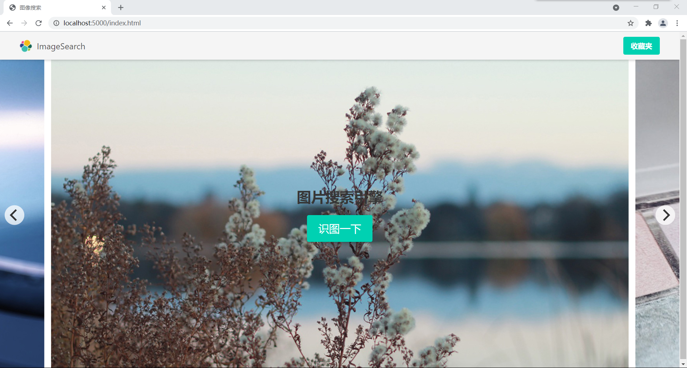

Click the <kbd>识图一下</kbd> button, we can look an image upload button.

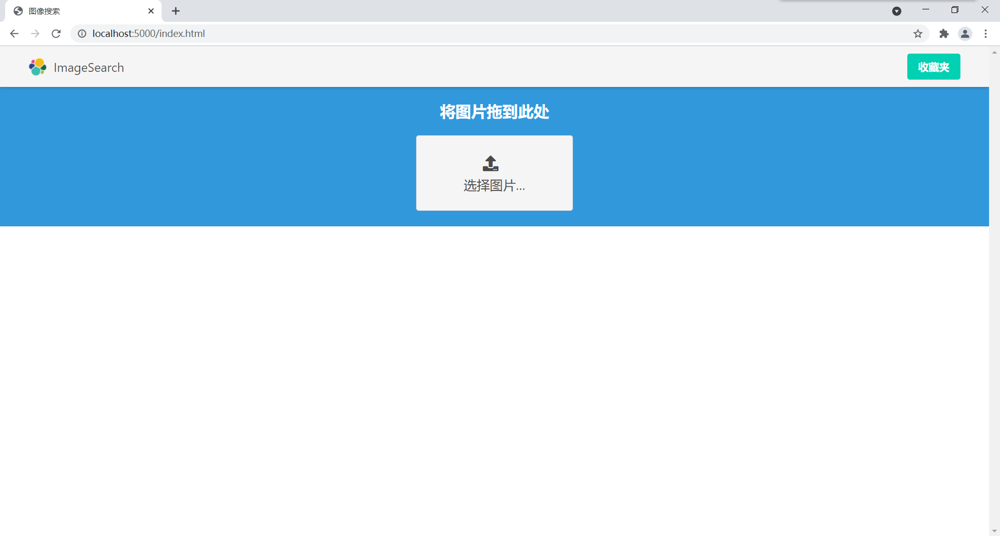

You can upload an image by two ways 
- Click on the button and select a file in the popup dialog
- Drag an image file and drop it on the blue region.

After selecting an image, the searching process will start automatically at the background, and a *searching gif* will appear.

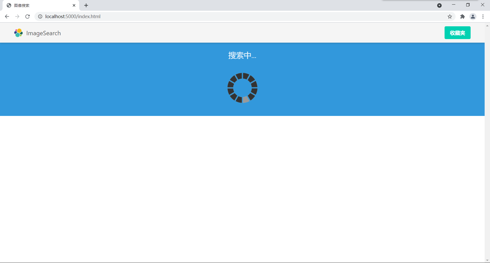

When the search process finished, the result will appear.

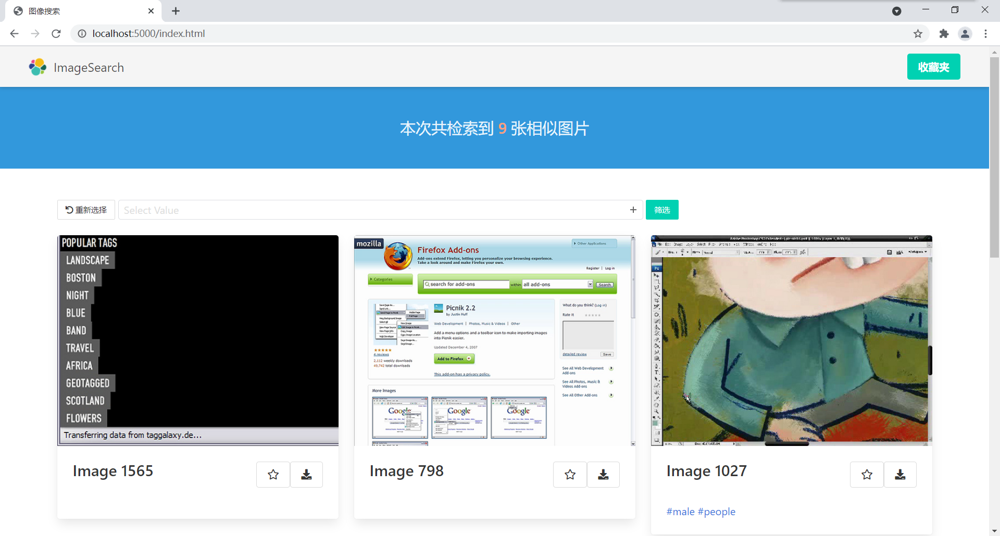

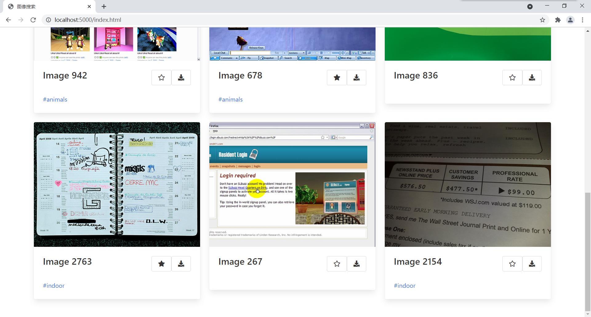

For each result image, there will be a card containing the image, image id, favorite button (the star), and a list of tags. 

The favorite button will be solid if you have added the image to your favorite list.

| Before favorite               | After favorite                |
| ----------------------------- | ----------------------------- |
| 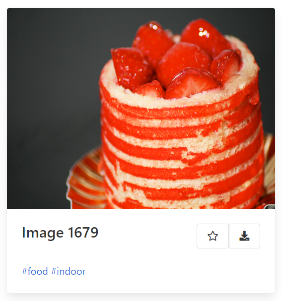 | 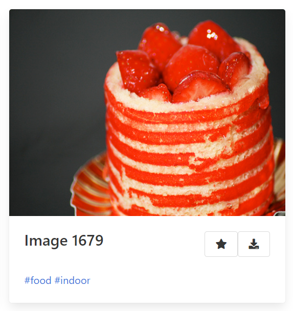 |

Click the image of a card, a viewer modal will show. In the modal, you can zoom in/out, flip vertically/horizontally, rotate left/right or even play a slide of the images.

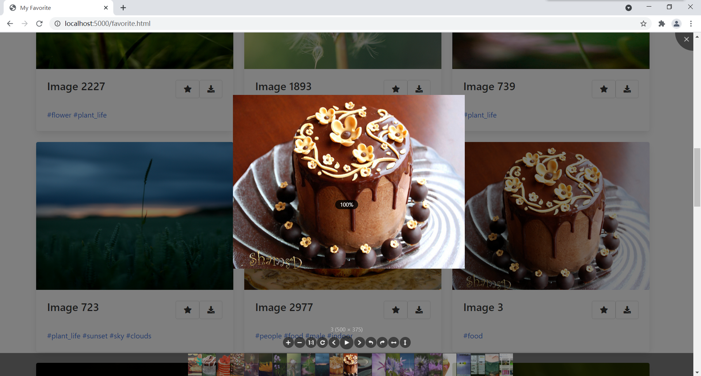

On the top of the page is the number of searching results. 

Before the results, there is a control bar. You can <kbd>重新选择</kbd>, or **filter the results by tags**.

> Filter the result whose tags contain "people" (The result is zoomed in because there is only one result)
> 
> 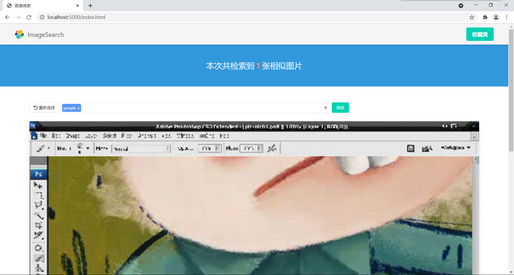

You can add an image to your favorite list by clicking the <kbd>Star</kbd> icon. And cancel it by clicking again. The star will shake.

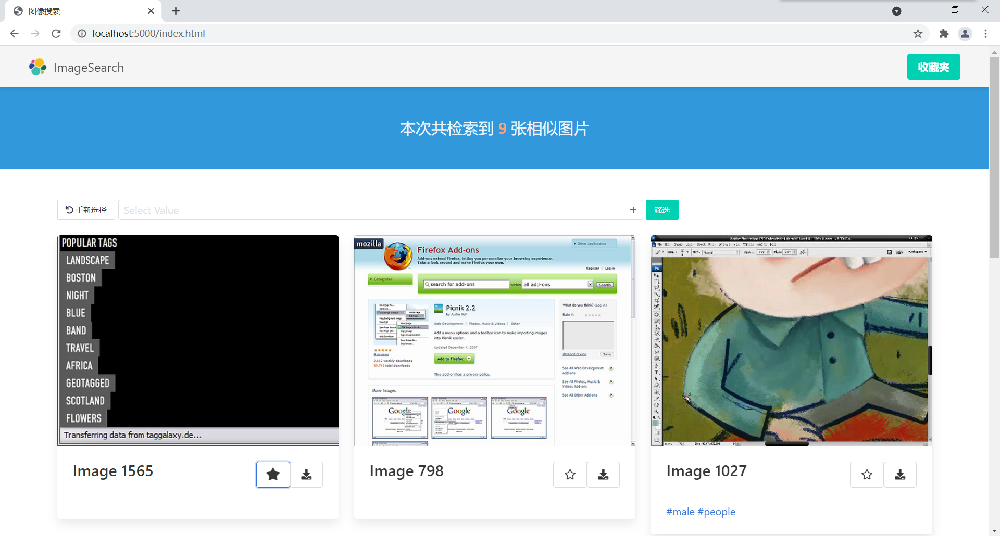

## My Favorite Page

You can browse your favorite images in this page.

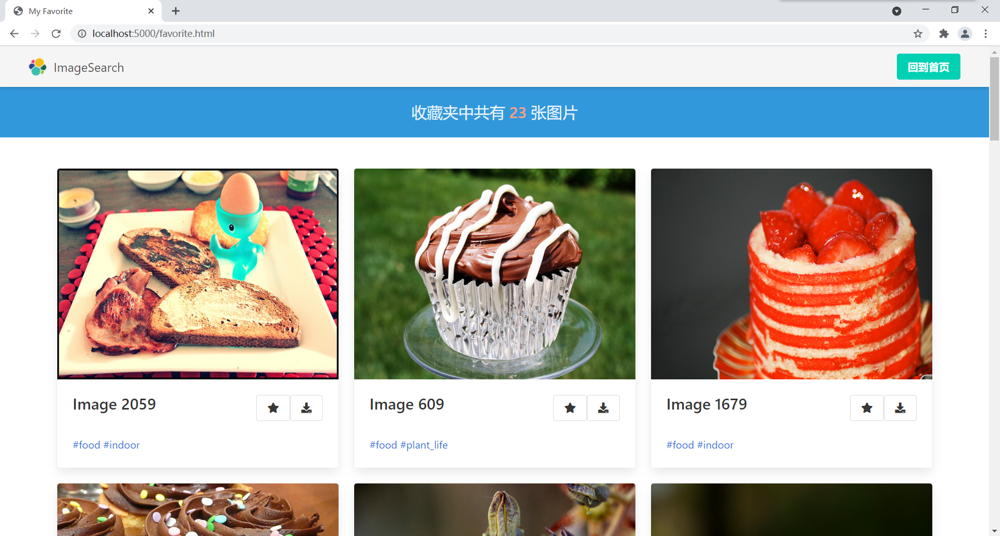


# Developing Environments

1. **Operating System**: Windows_NT x64 10.0.19042
2. **Visual Studio Code**: 1.56.2

## Dependencies

Generally, I use these library/technology to build this homework.

| Framework/Library | Where     | Remark                   |
|-------------------|-----------|--------------------------|
| *Knockout.js*     | Front End | MVVM Framework           |
| *Bulma*           | Front End | UI Style                 |
| *font-awesome*    | Front End | UI Icons                 |
| *flickity*        | Front End | Carousel in index page   |
| *viewerjs*        | Front End | Image viewer             |
| *slimselect*      | Front End | Dropdown menu tag filter |
| *animate.css*     | Front End | "Favorite" Animation     |
| *Flask*           | Back End  | Micro Web Framework      |
| *tensorflow*      | Back End  | DL Framework             |
| *numpy*           | Back End  | Recommendation Model     |
| *scipy*           | Back End  | Recommendation Model     |

## Package Versions

| Package    | Version |
|------------|---------|
| flask      | 1.1.2   |
| numpy      | 1.19.5  |
| scipy      | 1.6.2   |
| tensorflow | 2.5.0   |

## To install

`pip install -r requirements.txt`

